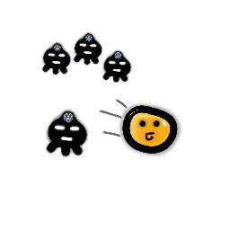

 

  

  <h3 align="center">OilRun - 2D Fancy Runner</h3>
  

    Built on Godot Engine.
     
    <a href="https://github.com/StasAndreich/OilRun-GodotGame/releases/tag/v1.0"><strong>Download »</strong></a>
  

 

  
Table of Contents

  <ol>
    <li>
      <a href="#about-the-project">About The Project</a>
      <ul>
        <li><a href="#built-with">Built With</a></li>
      </ul>
    </li>
    <li><a href="#acknowledgements">Acknowledgements</a></li>
  </ol>

## About The Project
Simple 2D runner game with fancy graphics and breathtaking story made with Godot Engine.
> Details suspended...

### Built With
This project was built on [Godot Engine](https://godotengine.org/) using native *GDScript*.

## Acknowledgements
* [Godot Docs](https://docs.godotengine.org/en/stable/)
